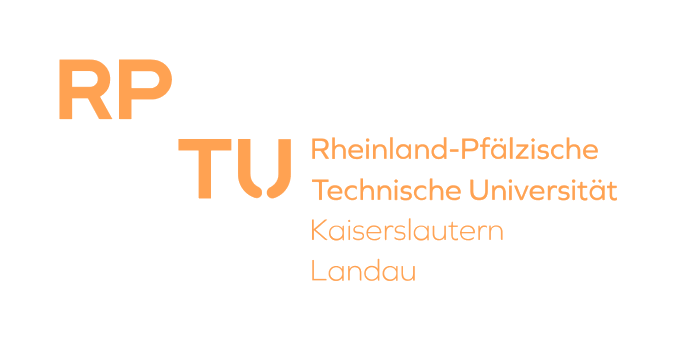

<div id="top"></div>
<!--
*** Thanks for checking out the Best-README-Template. If you have a suggestion
*** that would make this better, please fork the repo and create a pull request
*** or simply open an issue with the tag "enhancement".
*** Don't forget to give the project a star!
*** Thanks again! Now go create something AMAZING! :D
-->


<!-- PROJECT SHIELDS -->
<!--
*** I'm using markdown "reference style" links for readability.
*** Reference links are enclosed in brackets [ ] instead of parentheses ( ).
*** See the bottom of this document for the declaration of the reference variables
*** for contributors-url, forks-url, etc. This is an optional, concise syntax you may use.
*** https://www.markdownguide.org/basic-syntax/#reference-style-links
-->
[![Contributors][contributors-shield]][contributors-url]
[![Stargazers][stars-shield]][stars-url]
[![Issues][issues-shield]][issues-url]
<!--
[![MIT License][license-shield]][license-url]
[![LinkedIn][linkedin-shield]][linkedin-url]
-->


<!-- PROJECT LOGO -->
<br />
<div align="center">
  <a href="https://github.com/TUK-EIS/VDSProject">
    
  </a>
  <h3 align="center">
  VDS Class Project
  <br />
  Group #X
  <br />
  Winter Semester 2022/2023
  </h3>

  <p align="center">
    GitHub repository for the Verification of Digital Systems Class Project
    <br />
    <br />
    <a href="https://github.com/TUK-EIS/VDSProject/issues">Report Bug</a>
  </p>
</div>


<br />
<br />


<!-- TABLE OF CONTENTS -->
<details>
  <summary>Table of Contents</summary>
  <ol>
    <li>
      <a href="#about-the-project">About The Project</a>
    </li>
    <li>
      <a href="#getting-started">Getting Started</a>
      <ul>
        <li><a href="#prerequisites">Prerequisites</a></li>
        <li><a href="#installation">Installation</a></li>
      </ul>
    </li>
    <li><a href="#roadmap">Roadmap</a></li>
    <li><a href="#contact">Contact</a></li>
    <li><a href="#acknowledgments">Acknowledgments</a></li>
  </ol>
</details>


<!-- ABOUT THE PROJECT -->
## About The Project
In the course of this Lab assignment, students are going to implement a minimal BDD package in C++. This package implements the fundamental manipulation methods for ROBDDs as they were introduced in the lecture *Verification of Digital Systems* by Prof. Kunz. The package will be implemented using the Test Driven Development (TDD) paradigm presented by Dr. Wedler.

The project is split into three parts.
<p align="right">(<a href="#top">back to top</a>)</p>

#### Part1:
Implementation of the basic functionality of the BDD package using the TDD methodology. This is the biggest part of the project.

Main tasks in this part:
* Set up and maintain a Git repository
* Use CMake as a build system of the project
* Verify the code using GTest
* Set up a Continuous Integration (CI) pipeline with GitHub Actions **(Mandatory)**
* Use Doxygen (or a similar tool) to generate documentation for the API. _(Optional)_
<p align="right">(<a href="#top">back to top</a>)</p>

#### Part2:
Improvement of the performance of the implementation via provided benchmarks.

Main tasks in this part:
* Learning how to identify performance bottlenecks within the code.
* Analyzing benchmark results.
* How to overcome bottlenecks.
<p align="right">(<a href="#top">back to top</a>)</p>

#### Part3:
Extending the existing implementation by a practical application of BDD. Using BDDs, it is possible to symbolically represent a state-space. This representation allows to check quickly, whether a specific state is within the reachable state space or not.

<!--
[![Product Name Screen Shot][product-screenshot]](https://example.com)

There are many great README templates available on GitHub; however, I didn't find one that really suited my needs so I created this enhanced one. I want to create a README template so amazing that it'll be the last one you ever need -- I think this is it.

Here's why:
* Your time should be focused on creating something amazing. A project that solves a problem and helps others
* You shouldn't be doing the same tasks over and over like creating a README from scratch
* You should implement DRY principles to the rest of your life :smile:

Of course, no one template will serve all projects since your needs may be different. So I'll be adding more in the near future. You may also suggest changes by forking this repo and creating a pull request or opening an issue. Thanks to all the people have contributed to expanding this template!

Use the `BLANK_README.md` to get started.
-->
<p align="right">(<a href="#top">back to top</a>)</p>


<!-- GETTING STARTED -->
## Getting Started
Fork this repository and follow the instructions given in doc/ to complete the project.
<!--
This is an example of how you may give instructions on setting up your project locally.
To get a local copy up and running follow these simple example steps.
-->
### Prerequisites
List of Ubuntu packages required to complete the project:

* git-all
* libboost-all-dev
* build-essential


_No guarantee that this list is complete (Add other packages to the README)_
<!--
This is an example of how to list things you need to use the software and how to install them.
* npm
  ```sh
  npm install npm@latest -g
  ```
-->
<p align="right">(<a href="#top">back to top</a>)</p>

### Installation
1. Clone the repo
   ```sh
   git clone https://github.com/your_username_/VDSProject
   ```
**Installation with CLion**

CLion comes with CMake. 
2. Open CLion and open VDSProject/CMakeLists.txt as a project.
3. Select your target and build the project.
   
**Installation without CLion**


2. Navigate to the project folder and create a build directory
    ```sh
    cd VDSProject && mkdir build
    ```
3. Navigate to the build folder and invoke CMake
    ```sh
    cd build && cmake ../
    ```
4. Invoke make
    ```sh
    make
    ```   
<!--
_Below is an example of how you can instruct your audience on installing and setting up your app. This template doesn't rely on any external dependencies or services._

1. Get a free API Key at [https://example.com](https://example.com)
2. Clone the repo
   ```sh
   git clone https://github.com/your_username_/Project-Name.git
   ```
3. Install NPM packages
   ```sh
   npm install
   ```
4. Enter your API in `config.js`
   ```js
   const API_KEY = 'ENTER YOUR API';
   ```
-->
<p align="right">(<a href="#top">back to top</a>)</p>


<!-- ROADMAP -->
## Roadmap
#### Part-1
- [ ] TODO
- [X] DONE
<p align="right">(<a href="#top">back to top</a>)</p>

#### Part-2
- [ ] TODO
- [X] DONE
<p align="right">(<a href="#top">back to top</a>)</p>

#### Part-3
- [ ] TODO
- [X] DONE
<p align="right">(<a href="#top">back to top</a>)</p>

<!-- CONTACT -->
## Contact

<!-- Your Name - [@your_twitter](https://twitter.com/your_username) - email@example.com -->
Lucas Deutschmann & Philipp Schmitz - eit-vds-cp@rptu.de

### Collaborators

1. [Piotr Mikulowski](github.com/rureverek) - xal27fes@rptu.de
2. Johannes Stegmann - 
3. Emanuel Cortez - 

<p align="right">(<a href="#top">back to top</a>)</p>


<!-- ACKNOWLEDGMENTS -->
## Acknowledgments
Thank you Veli Durmuşcan, Shreya Vithal Kulhalli and Osama Omar Youssif Ayoub for the work on this README.md.


You might find helpful links below.

### Project Related Resources

#### Given Task Links
* [WSL](https://docs.microsoft.com/en-us/windows/wsl/install)
* [Google Test](https://github.com/google/googletest)
* [GitHub CI Interactive Tutorial](https://lab.github.com/githubtraining/github-actions:-hello-world)
* [Documenting C++ Code](https://developer.lsst.io/cpp/api-docs.html)
* [Doxygen Examples](https://www.doxygen.nl/results.html)
* [WSL Integration for CLion](https://www.jetbrains.com/help/clion/how-to-use-wsl-development-environment-in-product.html#wsl-tooclhain)
* [How to install Boost library in Ubuntu](https://stackoverflow.com/questions/12578499/how-to-install-boost-on-ubuntu)

<p align="right">(<a href="#top">back to top</a>)</p>

#### Additional Materials

* [README Template](https://github.com/othneildrew/Best-README-Template)
* [Travis CI Examples](https://github.com/deftio/travis-ci-cpp-example)

<p align="right">(<a href="#top">back to top</a>)</p>


<!-- MARKDOWN LINKS & IMAGES -->
<!-- https://www.markdownguide.org/basic-syntax/#reference-style-links -->
[contributors-shield]: https://img.shields.io/github/contributors/TUK-EIS/VDSProject.svg?style=for-the-badge
[contributors-url]: https://github.com/TUK-EIS/VDSProject/graphs/contributors
[forks-shield]: https://img.shields.io/github/forks/TUK-EIS/VDSProject.svg?style=for-the-badge
[forks-url]: https://github.com/TUK-EIS/VDSProject/network/members
[stars-shield]: https://img.shields.io/github/stars/TUK-EIS/VDSProject.svg?style=for-the-badge
[stars-url]: https://github.com/TUK-EIS/VDSProject/stargazers
[issues-shield]: https://img.shields.io/github/issues/TUK-EIS/VDSProject.svg?style=for-the-badge
[issues-url]: https://github.com/TUK-EIS/VDSProject/issues
<!--
[license-shield]: https://img.shields.io/github/license/othneildrew/Best-README-Template.svg?style=for-the-badge
[license-url]: https://github.com/othneildrew/Best-README-Template/blob/master/LICENSE.txt
[linkedin-shield]: https://img.shields.io/badge/-LinkedIn-black.svg?style=for-the-badge&logo=linkedin&colorB=555
[linkedin-url]: https://linkedin.com/in/othneildrew
-->
[product-screenshot]: images/screenshot.png
